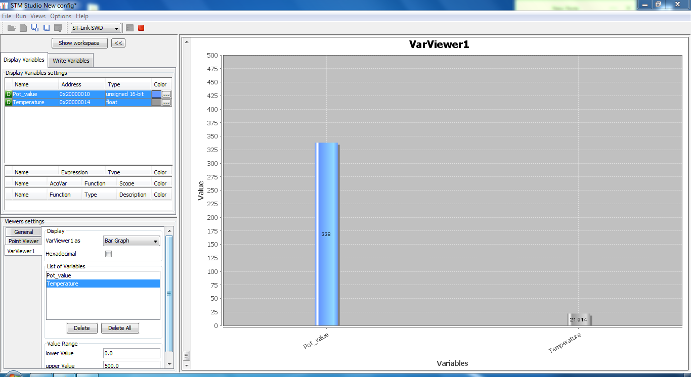

Read Pot and LM35 value with_ADC.

Note: This method only work with 1 channel per ADC converter (STM32F103C8T6 have two ADC converter so I can interface with 2 analog devices).If you want to use multiple channels per 1 ADC converter, please use ADC+DMA.

To check the result use debug mode or STMStudio.

